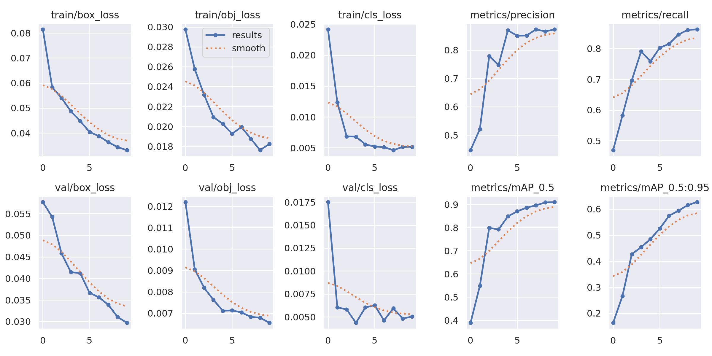
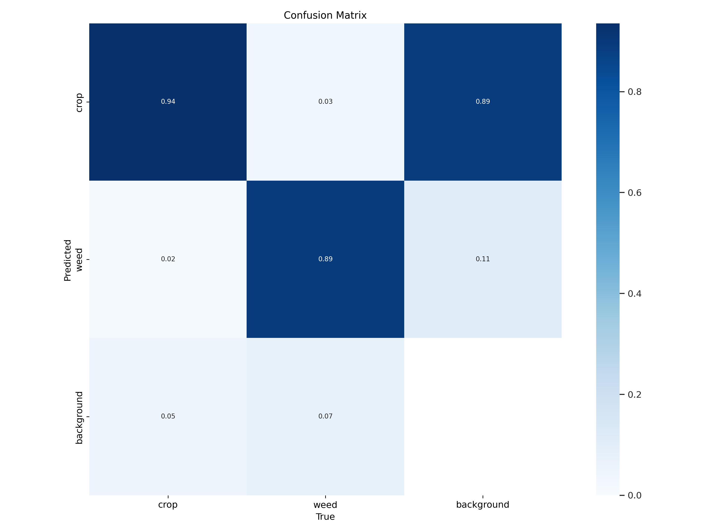
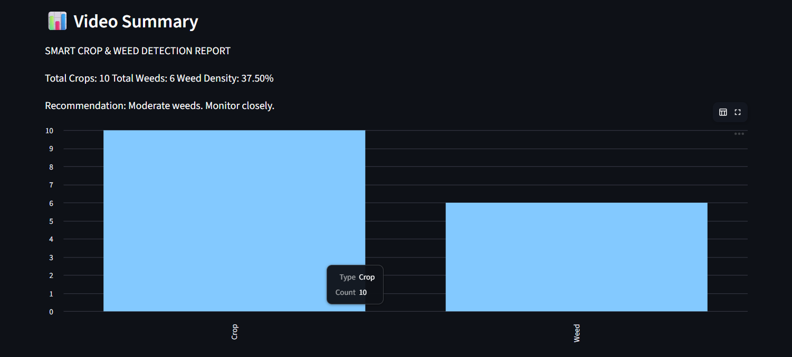
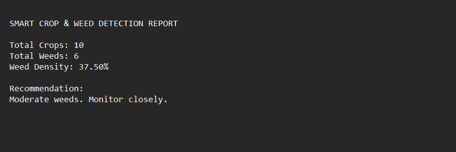
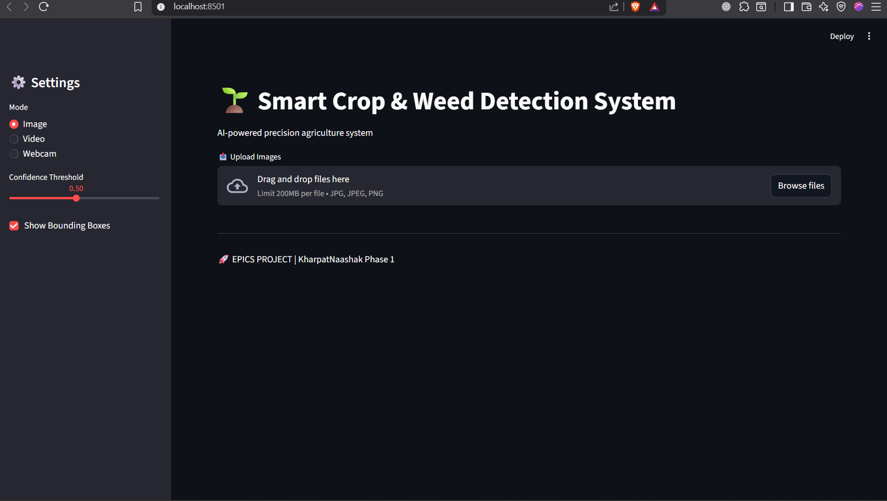
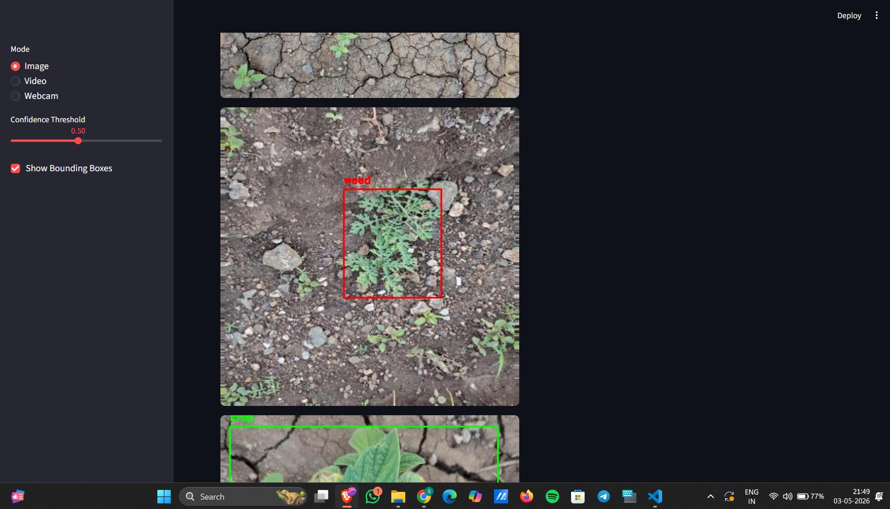
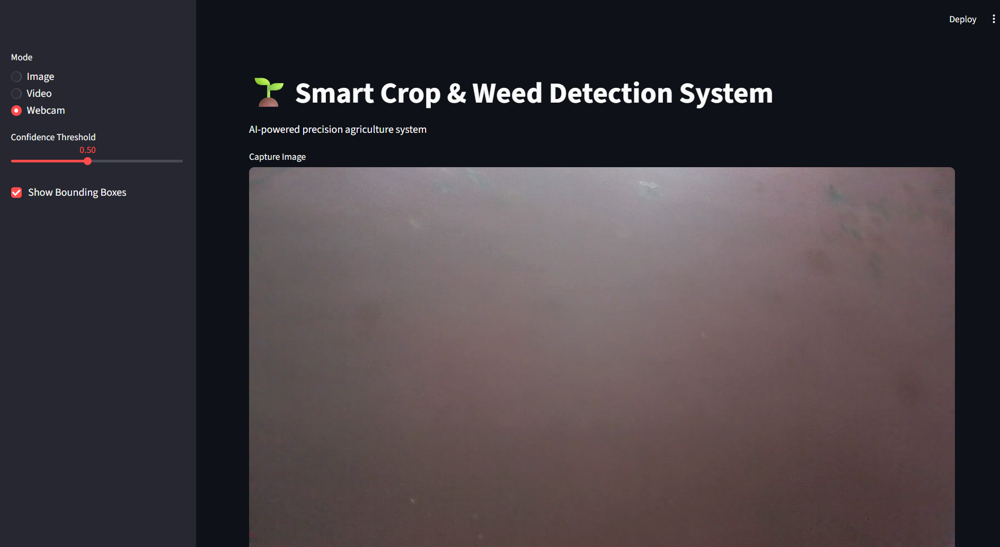

# 🌱 Smart Crop & Weed Detection System

### *KharpatNaashak – Phase 1*

---

## 📌 Overview

Agriculture is one of the most important sectors for sustaining human life, but one of its major challenges is the uncontrolled growth of weeds. Weeds compete with crops for essential resources such as nutrients, water, and sunlight, ultimately reducing agricultural productivity.

This project presents an **AI-powered crop and weed detection system** built using deep learning. The system leverages a **fine-tuned YOLOv3 (You Only Look Once) model** to detect and classify crops and weeds in real-time.

The solution is deployed through an **interactive Streamlit web application**, supporting multiple input modes such as images, videos, and webcam streams. This makes it a practical tool for real-world agricultural monitoring and analysis.

---

## 🎯 Problem Statement

Weeds negatively impact crop yield by competing for resources and forcing farmers to rely heavily on chemical pesticides. These chemicals can harm both the environment and human health.

The goal of this project is to build an **automated detection system** that:

* Identifies crops and weeds accurately
* Reduces reliance on harmful chemicals
* Assists in smarter decision-making for farmers

---

## 🚀 Features

* 🌱 Crop vs Weed Detection using YOLOv3
* 🖼 Multi-image upload detection
* 🎥 Video-based detection
* 📷 Webcam-based real-time detection
* 🌐 Interactive web interface using Streamlit
* 📊 Field analysis:

  * Crop count
  * Weed count
  * Weed density calculation
* 📈 Visualization using graphs
* 📄 Downloadable detection report
* ⚡ Adjustable confidence threshold

---

## 🧠 Methodology / Approach

The development of this project followed a structured deep learning and system integration pipeline focused on real-time agricultural weed detection.

Instead of training an object detection model entirely from scratch, this project utilized a **previously trained YOLOv3 weed detection model** and further adapted it for the required agricultural detection tasks through fine-tuning and application-level integration.

The primary focus of the project was on:

* Fine-tuning and optimizing the detection model
* Building a complete real-time detection system
* Integrating multiple input modes
* Developing an interactive and user-friendly deployment interface

The overall methodology can be divided into the following stages:

---

### 1. Model Selection

YOLOv3 (You Only Look Once Version 3) was selected as the core object detection architecture because of its:

* Real-time detection capability
* High detection speed
* Strong performance in multi-object detection tasks
* Suitability for computer vision applications requiring fast inference

Since YOLOv3 is widely used for real-time object detection systems, it was considered an appropriate choice for agricultural field analysis.

---

### 2. Fine-Tuning of Existing Model

Rather than building a new model architecture from the ground up, an already trained YOLOv3 weed detection model was used as the base model.

The model was then fine-tuned on the agricultural dataset to improve its adaptability and performance for crop and weed detection.

This process involved:

* Configuring the model for the required classes
* Adjusting training parameters
* Testing detection performance on field images
* Validating prediction outputs

The objective was to adapt the model effectively for practical agricultural use cases while leveraging the strengths of transfer learning and pre-trained weights.

---

### 3. Dataset Preparation

The dataset consisted of annotated agricultural images containing crops and weeds.

The preparation process included:

* Organizing images and labels
* Using YOLO annotation format
* Normalizing bounding box coordinates
* Separating data for training and validation

Each object in the images was labeled as either:

* Crop 🌾
* Weed 🌿

Proper dataset formatting was essential to ensure compatibility with the YOLOv3 detection pipeline.

---

### 4. Detection Pipeline

The detection system was implemented using OpenCV and the YOLOv3 inference pipeline.

The workflow included:

* Reading image/video frames
* Preprocessing frames using blob generation
* Passing inputs through the YOLO network
* Extracting object predictions and confidence scores
* Applying Non-Max Suppression (NMS) to remove duplicate detections

Bounding boxes were drawn around detected crops and weeds with separate labels and color coding for easier visualization.

---

### 5. Real-Time Application Development

To make the project interactive and practical, the detection pipeline was integrated into a web-based application using Streamlit.

The application supports multiple modes:

* 🖼 Image Detection
* 🎥 Video Detection
* 📷 Webcam-Based Real-Time Detection

The Streamlit interface allows users to:

* Upload images and videos
* Capture frames using webcam
* View live detection results
* Analyze crop and weed distribution

This transformed the project from a simple machine learning model into a complete end-to-end AI application.

---

### 6. Analytical Features

In addition to object detection, several analytical features were added to improve usability and interpretation of results.

These include:

* Crop count
* Weed count
* Weed density estimation
* Graphical visualization of detections
* Downloadable detection reports

These features help users better understand field conditions and make data-driven agricultural decisions.

---

### 7. Performance Evaluation

The model’s performance was evaluated using standard object detection metrics such as:

* mAP (Mean Average Precision)
* Precision
* Recall
* Confusion Matrix Analysis

Training graphs and confusion matrices were used to analyze model learning behavior and classification performance.

---

### 8. System Integration Focus

A major objective of this project was not only model adaptation but also the creation of a deployable and user-friendly system.

Therefore, emphasis was placed on:

* Real-time usability
* Interactive UI development
* Multiple input support
* Practical deployment workflow

The final system demonstrates how deep learning and computer vision can be integrated into intelligent agricultural applications for precision farming.


---

## 📊 Dataset

* Format: YOLO annotation format
* Image size: 512 × 512
* Classes:

  * Crop
  * Weed
 
** Dataset Link** : https://www.kaggle.com/datasets/ravirajsinh45/crop-and-weed-detection-data-with-bounding-boxes

---

## 📈 Results

* **mAP@50:** ~91%
* **Precision:** ~87%
* **Recall:** ~86%

The model performs reliably across different field conditions and lighting variations.

---

## 📊 Model Performance & Analysis

### 📉 Training Metrics



The training curves show consistent improvement, with decreasing loss and increasing mAP, indicating effective fine-tuning.

---

### 🔍 Confusion Matrix



The confusion matrix demonstrates high classification accuracy, with most predictions correctly classified along the diagonal.

---

### 📊 Detection Statistics



This visualization shows the distribution of detected crops and weeds.

---

### 📄 Generated Report



The system generates a detailed report including crop count, weed count, and actionable recommendations.

---

## 📸 Application Preview

### 🖥️ User Interface



### 🖼 Image Detection



### 🎥 Video Detection


### 📷 Webcam Detection



---

## ⚙️ Tech Stack

* Python
* OpenCV
* YOLOv3
* Streamlit
* NumPy / Pandas

---
## 📦 Model Weights

The model weight files are not included in this repository due to GitHub file size limitations.

Both the pre-trained YOLOv3 weights and the fine-tuned model (`fine tune.pt`) can be downloaded from the Google Drive folder below:

🔗 **Download Weights:**  https://drive.google.com/drive/folders/1lTbOm-9-yeJ0yTaTFLYtyzUCbuXBRr6G?usp=sharing

After downloading, place the files inside the appropriate model directory before running the application.


---

## ▶️ Installation & Usage

### 1. Install dependencies

```bash
pip install -r requirements.txt
```

### 2. Run the application

```bash
streamlit run app.py
```

### 3. Use the system

* Upload image/video OR use webcam
* View detection results
* Analyze crop vs weed distribution
* Download report

---

## 📂 Project Structure

```
Smart-Crop-Weed-Detection/
│
├── app.py
├── models/
│   └── best.pt
├── performing_detection/
├── training/
├── assets/
├── requirements.txt
├── README.md
```

---

## 💡 Key Learnings

* Fine-tuning pre-trained deep learning models
* Understanding YOLO architecture
* Handling dataset annotation formats
* Building end-to-end AI applications
* Integrating ML models with web interfaces

---

## 🔮 Future Scope (Phase 2 – KharpatNaashak)

This project is part of a larger system named **KharpatNaashak**.

Future improvements include:

* Upgrading to **YOLOv11**
* Improving detection accuracy and speed
* Real-world deployment in agricultural fields
* Integration with automated weed removal systems

> 🔧 **Note:** The YOLOv11-based Phase 2 (KharpatNaashak) is being developed by my teammate **Mahi Singh**.


## 🙏 Acknowledgement

This project builds upon a previously trained YOLOv3 weed detection model and related implementation references used as the foundational base for further development and fine-tuning.

The primary contributions of this project include:

* Fine-tuning and adapting the detection model
* Developing a complete Streamlit-based real-time application
* Integrating image, video, and webcam detection
* Adding analytical and reporting features for agricultural field analysis

Proper credit is given to the original implementation and research resources that inspired the base detection framework.

> 🔗 Original reference/source: [[ GitHub repository ]](https://github.com/ravirajsinh45/Crop_and_weed_detection)


## 👨‍💻 Authors & Contributors

* **Saksham Trivedi** — Model fine-tuning, system integration, Streamlit application development
* **Mahi Singh** — Future development (KharpatNaashak Phase 2 – YOLOv11 based system)
* **Nandani Tripathi** — Project support and contributions

---

## 🤝 Collaboration

This project is part of an evolving AI-based agricultural system under **KharpatNaashak**, developed collaboratively with contributions from team members working on different phases and enhancements.


## ⭐ Conclusion

This project demonstrates how deep learning and computer vision can be applied to solve real-world agricultural challenges. By combining YOLOv3 with an interactive UI, the system provides a practical and scalable solution for weed detection and smart farming.
